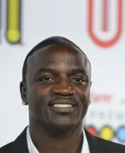
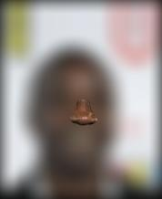
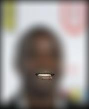

## Part 5: Test Results and Feature-Specific Generalization Analysis

### 1. Test Database and Experimental Design

For Part 5, I evaluated the final neural-network-based face recognition system on a held-out test condition designed to assess how well the model generalizes when only limited facial information is available. The test database was derived from the closed-set CelebA identity classification setup used in Part 4. The classifier was trained on a subset of CelebA identities and evaluated on held-out images from the same closed-set identities, but the Part 5 test condition differs substantially from the original training and validation conditions.

The original training and validation images are standard face images resized and normalized for input into the convolutional neural network. In contrast, the Part 5 test images are transformed using semantic face parsing. I used a BiSeNet-based face parsing model to segment each face image into semantic regions such as eyes, eyebrows, nose, mouth, hair, and skin. For each test condition, only one semantic region was preserved while the rest of the image was blurred. This creates a feature-specific test set that is different from the training and validation data because the classifier was not trained on images where most facial information was removed.

This test setup is useful for evaluating generalization because it measures whether the classifier can still recognize identity when only a restricted facial feature remains clear. Unlike random occlusion, which removes arbitrary image regions, semantic feature-preserving blur produces interpretable test conditions. Each test condition asks a specific question: how much identity information is retained by the eyes alone, the nose alone, the mouth alone, the hair alone, or the skin region alone?

The test set used for this experiment consisted of 200 held-out validation/test images from the closed-set classification subset. The clean version of these images provides a baseline accuracy, while the feature-specific blurred versions serve as out-of-distribution test cases. Although the images come from the same identity set, the feature-preserved versions are visually and statistically different from the normal training images. Therefore, this experiment tests the model’s ability to generalize beyond ordinary full-face inputs.

### Feature-Specific Test Examples

The figure below shows the original image, the BiSeNet parsing output, and several feature-only blurred test conditions.

  
  
  

  <b>Original</b> &nbsp;&nbsp;&nbsp;&nbsp;
  <b>BiSeNet Parsing</b> &nbsp;&nbsp;&nbsp;&nbsp;
  <b>Eyes Only</b>

  
  
  

  <b>Nose Only</b> &nbsp;&nbsp;&nbsp;&nbsp;
  <b>Mouth Only</b> &nbsp;&nbsp;&nbsp;&nbsp;
  <b>Skin Only</b>

### 2. Test Accuracy and Metrics

The main metric used in this section is classification accuracy, consistent with the closed-set classification setup from Part 4. Accuracy is computed as the proportion of test images for which the predicted identity label matches the true identity label. This is the appropriate metric for the from-scratch CNN classifier because the model outputs a discrete identity class.

The clean test subset achieved an accuracy of **64.5%**. This is consistent with the validation performance observed in Part 4, where the from-scratch CNN achieved approximately **65.84%** best validation accuracy. This confirms that the clean test subset reflects the same general level of performance as the earlier validation evaluation.

### Feature-Specific Test Accuracy

| Test Condition | Accuracy | Drop from Clean |
|---|---:|---:|
| Clean test subset | **64.5%** | — |
| Eyes only | **30.5%** | **34.0 pts** |
| Eyebrows only | **31.5%** | **33.0 pts** |
| Nose only | **27.5%** | **37.0 pts** |
| Mouth only | **29.0%** | **35.5 pts** |
| Hair only | **41.0%** | **23.5 pts** |
| Skin only | **47.0%** | **17.5 pts** |

The results show that classification performance decreases substantially when the model is forced to rely on only one localized facial feature. The largest accuracy drop occurs for the nose-only condition, where accuracy falls from 64.5% to 27.5%. The eyes-only and mouth-only conditions also perform poorly, achieving 30.5% and 29.0% accuracy, respectively. This suggests that compact internal facial components are not sufficient by themselves for reliable identity recognition.

The best feature-only results occur for skin and hair. Skin-only images achieve 47.0% accuracy, and hair-only images achieve 41.0% accuracy. These results suggest that broader appearance cues preserve more identity information than small isolated features. Skin regions may retain information about face shape, complexion, and broad facial texture, while hair regions may preserve hairstyle and head-outline cues. Although these cues are not sufficient to match clean performance, they preserve more information than individual internal features such as the eyes, nose, or mouth.

### 3. Analysis of Generalization Behavior

The main conclusion from this experiment is that the classifier depends on distributed facial evidence rather than any single localized feature. When the full face is visible, the CNN can combine many sources of information: eyes, nose, mouth, face shape, skin texture, hair, and spatial relationships between components. When only one region is preserved, most of these relationships are destroyed, and the classifier’s accuracy drops sharply.

This is expected because human face recognition and neural face recognition both rely heavily on the configuration of multiple features. The relative arrangement of the eyes, nose, mouth, skin texture, and face outline carries important identity information. By blurring everything except one semantic region, the test images remove much of the global structure that the model learned during training.

The poor performance of eyes-only, nose-only, and mouth-only images shows that individual compact facial components are not enough for this classifier to reliably identify people. These regions may contain useful information, but not enough on their own. In particular, the nose-only condition performs worst, suggesting that the model does not treat the nose as a sufficiently distinctive standalone feature. The eyes and mouth perform slightly better but still suffer major accuracy drops.

The relatively stronger performance of skin-only and hair-only images is also important. These results indicate that the model may rely more heavily on broad visual patterns than expected. Skin regions may preserve overall face texture and some shape cues, while hair may preserve hairstyle, color, and silhouette. This is useful but also potentially concerning: if a model relies heavily on hair or broad appearance cues, it may be vulnerable to changes in hairstyle, lighting, makeup, or image conditions.

### 4. Why Test Performance Is Worse

The feature-specific test results are worse than the clean validation results because the feature-only images are out-of-distribution relative to the training data. The model was trained on full face images, where identity information is distributed across the entire face and surrounding appearance. It was not trained to classify images where only one semantic feature remains clear while the rest is blurred.

There are several reasons for the performance drop.

First, the transformation removes global facial structure. The CNN learns filters that respond to spatial patterns across the full image. When most of the image is blurred, these learned spatial relationships are disrupted.

Second, the feature-only images remove contextual relationships between facial components. The identity information in a face is not stored only in isolated regions. Instead, it comes from the combination of multiple features and their relative positions.

Third, the feature masks generated by BiSeNet are sometimes small, especially for features such as eyes and eyebrows. Even when preserved sharply, these regions occupy only a small fraction of the image, leaving the classifier with limited visual evidence.

Fourth, blurring the rest of the image changes the image distribution. The model was trained on natural-looking faces, not heavily blurred images. This distribution shift likely reduces confidence and increases prediction errors.

Finally, the from-scratch CNN has limited generalization ability compared with the pretrained model studied earlier. In Part 4, the from-scratch CNN showed a meaningful gap between training and validation accuracy, indicating overfitting. The Part 5 feature-only experiment makes this limitation more visible by testing the model under a more difficult and unfamiliar input condition.

### 5. Improvements and Future Work

Several improvements could reduce the observed error rates.

First, the model could be trained with feature-specific augmentation. During training, some images could be randomly transformed using semantic blur or partial face masking. This would expose the model to feature-limited inputs and may improve robustness.

Second, the dataset could be expanded. The from-scratch CNN is limited by the relatively small number of images per identity. More images per identity and more variation in pose, lighting, and expression would help the model learn more generalizable features.

Third, transfer learning could be used more directly for the classification task. The pretrained model from Part 4 achieved much stronger performance than the from-scratch CNN, suggesting that large-scale pretraining provides more robust facial representations.

Fourth, feature-specific experiments could be extended to combinations of features. For example, testing “eyes + nose,” “eyes + mouth,” or “skin + hair” would help determine which combinations preserve the most identity information.

Fifth, the feature-specific results could guide adversarial patch placement. If certain facial regions strongly affect recognition, those regions may be good candidates for future patch-based perturbation experiments.

### 6. Conclusion

Part 5 evaluates the trained face classification model under a feature-specific test condition using BiSeNet face parsing. The clean test accuracy is 64.5%, while feature-only accuracies drop substantially. Eyes-only, nose-only, and mouth-only conditions perform near 27–31%, while hair-only and skin-only conditions perform better at 41.0% and 47.0%.

These results show that the model does not recognize identity reliably from a single compact facial feature. Instead, it depends on distributed facial evidence and broader appearance cues. The feature-specific test set therefore provides a meaningful generalization challenge and reveals how the model’s performance changes when normal full-face structure is removed.
